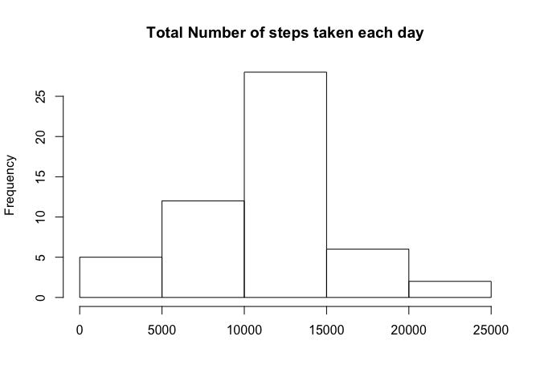
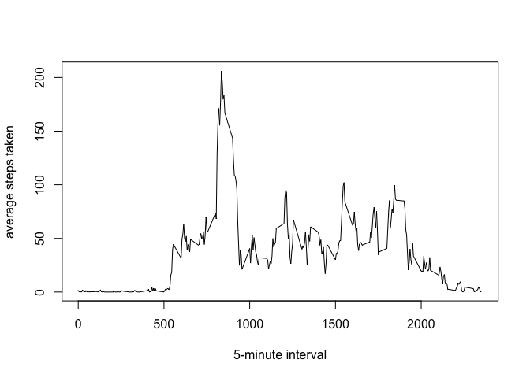
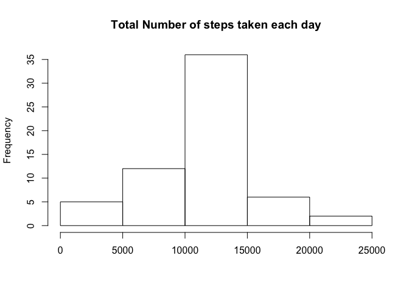
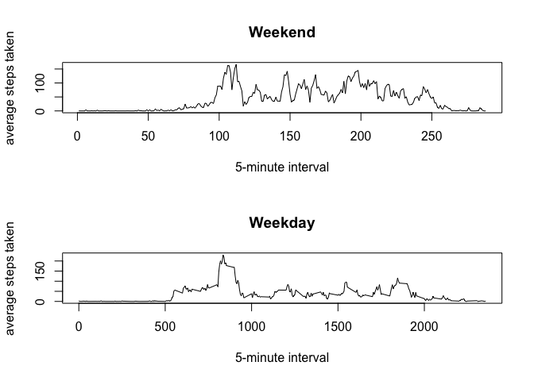

# Reproducible Research: Peer Assessment 1


## Loading and preprocessing the data


```r
library(plyr)
```

```
## Warning: package 'plyr' was built under R version 3.1.3
```

```r
unzip("activity.zip")

#load the raw data
activity <- read.csv("activity.csv")
activity$date <- as.Date(activity$date)

# create a dataset that's easier to work with by counting up all the steps per day and creating
# a simple data.frame with that information

steps_per_day <- ddply(activity, .(date), summarise, sum=sum(steps))
```

## What is mean total number of steps taken per day?

### Make a histogram of the total number of steps taken each day

```r
# plot 
hist(steps_per_day$sum, main="Total Number of steps taken each day", xlab="")
```

 

### Calculate and report the mean and median total number of steps taken per day


```r
# mean & median
mean(steps_per_day$sum, na.rm=TRUE)
```

```
## [1] 10766.19
```

```r
median(steps_per_day$sum, na.rm=TRUE)
```

```
## [1] 10765
```

## What is the average daily activity pattern?

### Make a time series plot (i.e. type = "l") of the 5-minute interval (x-axis) and the average number of steps taken, averaged across all days (y-axis)

```r
# create a dataset of the average steps per interval, then plot it
average_per_interval <- ddply(activity, .(interval), summarise, mean=mean(steps, na.rm=TRUE))
plot(average_per_interval, type="l", xlab="5-minute interval", ylab="average steps taken")
```

 

### Which 5-minute interval, on average across all the days in the dataset, contains the maximum number of steps?

```r
# max interval value
average_per_interval[average_per_interval==max(average_per_interval$mean)]
```

```
## [1] 206.1698
```
## Imputing missing values

### Calculate and report the total number of missing values in the dataset (i.e. the total number of rows with NAs)


```r
# Calculate and report the total number of missing values in the dataset (i.e. the 
# total number of rows with NAs)
sum(is.na(activity$steps))
```

```
## [1] 2304
```

### Devise a strategy for filling in all of the missing values in the dataset. The strategy does not need to be sophisticated. For example, you could use the mean/median for that day, or the mean for that 5-minute interval, etc.

A: using the average_per_interval dataset, fill in missing interval values with the calculated 
average for that interval.

### Create a new dataset that is equal to the original dataset but with the missing data filled in.


```r
# set NA steps to the average steps for that interval
activity_full <- activity
daily_average_mean <-tapply(activity$steps, activity$interval, mean, na.rm=TRUE)

activity_full[which(is.na(activity_full$steps)),1] <-
  daily_average_mean[as.character(activity_full[which(is.na(activity_full$steps)),3])]
```

### Make a histogram of the total number of steps taken each day and Calculate and report the mean and median total number of steps taken per day. Do these values differ from the estimates from the first part of the assignment? What is the impact of imputing missing data on the estimates of the total daily number of steps?


```r
steps_per_day_full <- ddply(activity_full, .(date), summarise, sum=sum(steps))

# plot 
hist(steps_per_day_full$sum, main="Total Number of steps taken each day", xlab="")
```

 

```r
# mean & median
mean(steps_per_day_full$sum)
```

```
## [1] 10766.19
```

```r
median(steps_per_day_full$sum)
```

```
## [1] 10766.19
```

```r
# impact to mean and median
mean(steps_per_day$sum, na.rm = TRUE) - mean(steps_per_day_full$sum)
```

```
## [1] 0
```

```r
median(steps_per_day$sum, na.rm=TRUE)- median(steps_per_day_full$sum)
```

```
## [1] -1.188679
```

## Are there differences in activity patterns between weekdays and weekends?


```r
activity_full$daytype <- as.factor(c("weekend", "weekday"))
activity_full$day <- weekdays(activity_full$date)

activity_full[activity_full$day == "Sunday" | activity_full$day == "Saturday", 4] <- factor("weekend")
activity_full[!(activity_full$day == "Sunday" | activity_full$day == "Saturday"), 4] <- factor("weekday")

# Create the average number of steps plots with the weekend and weekday data
weekend <- subset(activity_full, daytype == "weekend")
weekday <- subset(activity_full, daytype == "weekday")

average_per_interval_weekend <- ddply(weekend, .(interval), summarise, mean=mean(steps))
average_per_interval_weekday <- ddply(weekday, .(interval), summarise, mean=mean(steps))

par(mfrow=c(2,1))
plot(average_per_interval_weekend$mean, type="l", xlab="5-minute interval", ylab="average steps taken", main="Weekend")
plot(average_per_interval_weekday, type="l", xlab="5-minute interval", ylab="average steps taken", main="Weekday")
```

 
